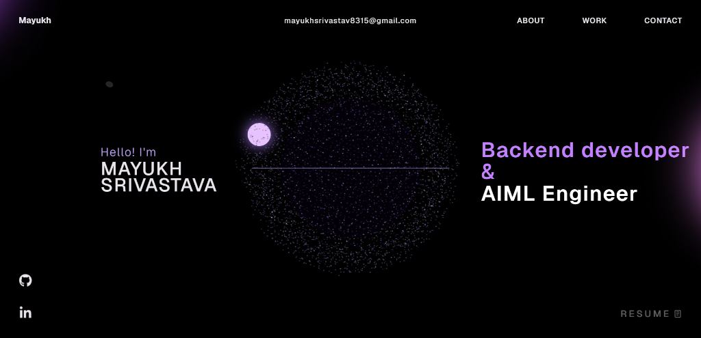

# Mayukh's Portfolio Website 🚀

<div align="center">
  
  [](https://reactjs.org/)
  [](https://www.typescriptlang.org/)
  [](https://threejs.org/)
  [](https://greensock.com/gsap/)
  [](https://vitejs.dev/)

  <p align="center">
    A premium, high-performance interactive portfolio and digital resume designed to showcase bleeding-edge frontend design, custom 3D web graphics, backend architecture capabilities, and AIML pipelines.
  </p>
</div>

---

## 🌌 Live Preview

<div align="center">
  
</div>

---

## 📖 Table of Contents
- [🌌 Live Preview](#-live-preview)
- [⚙️ Tech Stack & Technologies](#️-tech-stack--technologies)
- [✨ Core Design & Tech Features](#-core-design--tech-features)
- [📂 Project Structure](#-project-structure)
- [💻 What I Do & Skillset](#-what-i-do--skillset)
- [💡 Running the Project Locally](#-running-the-project-locally)
- [📄 License](#-license)

---

## ⚙️ Tech Stack & Technologies

- **Frontend Core:** React 18, TypeScript, ES6+ JavaScript
- **3D Graphics & Physics:** Three.js, React Three Fiber (R3F), React Three Drei, Canvas elements
- **Animation & Transitions:** GSAP (GreenSock Animation Platform) + Custom ScrollTrigger integrations
- **Build Tooling:** Vite (ultra-fast compilation & HMR)
- **Styling:** Premium Vanilla CSS, interactive micro-animations, glassmorphic UI elements

---

## ✨ Core Design & Tech Features

*   **Custom 3D Animations:** Implements a dynamic, particle-based sphere system with Three.js that smoothly adapts to user cursor positions and scroll depths, replacing heavy traditional assets with mathematically generated 3D meshes.
*   **Production-Ready Animations:** All GSAP scroll animations and page transitions have been optimized and rewritten using core, standard, licensing-compliant `gsap` API constructs and native DOM event listeners, completely eliminating licensing friction while maintaining flawless high-refresh-rate visuals.
*   **Highly Interactive Panels:** Dynamic interactive cards and custom-designed responsive tabs with micro-interactions that engage visitors as they explore technical skillsets.
*   **Responsive Custom Cursor:** A modern, organic magnetic cursor that changes size and opacity based on hover elements and active interactive components.
*   **Premium Dark Mode Aesthetic:** Vibrant neon/violet details set against a deep rich dark backdrop for a highly premium, modern developer look.

---

## 📂 Project Structure

```bash
mayukh-portfolio/
├── public/                 # Static assets (3D models, resumes, local images)
│   ├── images/             # Tech badges and portfolio previews
│   └── models/             # Custom 3D files
├── src/
│   ├── assets/             # Global media files and graphics
│   ├── components/         # Interactive React components
│   │   ├── Character/      # 3D interactive models
│   │   ├── styles/         # Component-specific stylesheet tokens
│   │   ├── utils/          # GSAP animation helpers and DOM scripts
│   │   ├── Navbar.tsx      # Magnetic, floating navigation system
│   │   ├── Landing.tsx     # Hero banner and introduction section
│   │   ├── TechStack.tsx   # Skill matrix & animated canvas showcase
│   │   ├── WhatIDo.tsx     # Expandable interactive skillset panels
│   │   └── Work.tsx        # Highlight projects showcase
│   ├── context/            # React state & theme context providers
│   ├── App.tsx             # Root layout assembler
│   ├── index.css           # Global CSS variables, custom cursors & animations
│   └── main.tsx            # Application entrypoint
├── vite.config.ts          # Custom plugin & building configuration
└── tsconfig.json           # TypeScript configuration
```

---

## 💻 What I Do & Skillset

### 🛠️ Develop & Backend Engineering
*   **Python, Django, Spring Boot, Java, C++**
*   Building high-performance RESTful APIs, modular services, custom database integration, and robust authentication middleware.
*   Integrating SQL & SQLite database architectures.

### 🚀 Deploy & DevOps
*   **Git, GitHub Actions, Linux, CI/CD**
*   Automating clean deployment pipelines, setting up secure APIs, data-processing automation, and integrating AIML model scoring triggers directly into web architectures.

---

## 💡 Running the Project Locally

To test out the portfolio website locally on your own machine:

1. **Clone the repository**
   ```bash
   git clone https://github.com/mayukh79/Mayukh-portfolio.git
   cd Mayukh-portfolio
   ```

2. **Install the necessary dependencies**
   ```bash
   npm install
   ```

3. **Run the development server**
   ```bash
   npm run dev
   ```
   *The project is deployed at https://mayukh-portfolio.vercel.app/*

---

## 📄 License

This project is licensed under the Personal Portfolio License (PPL) v1.0. See the [LICENSE](LICENSE) file for full details.
